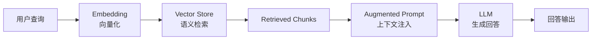
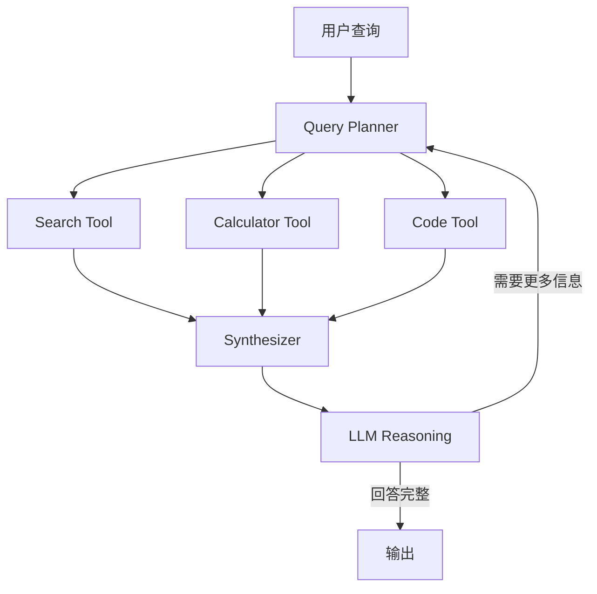
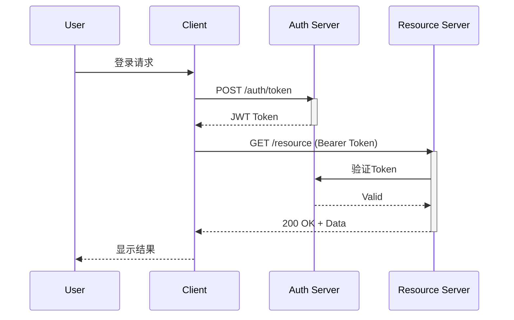
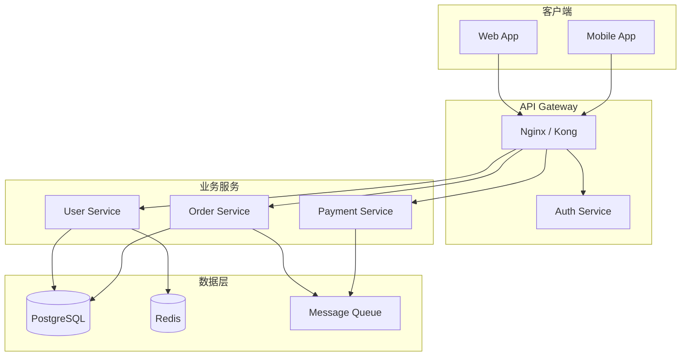
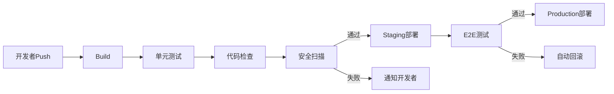
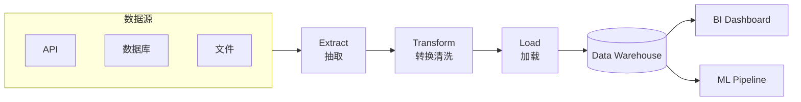
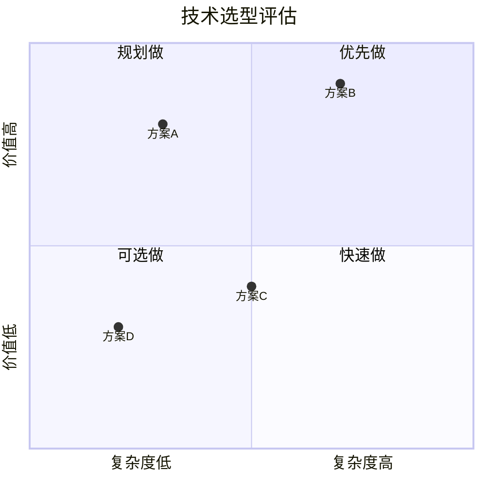
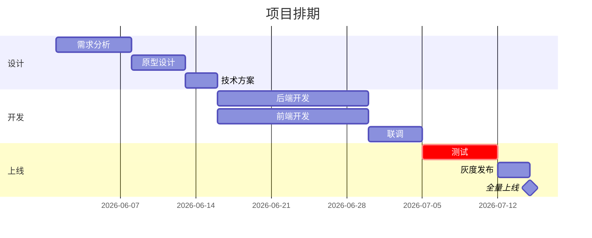
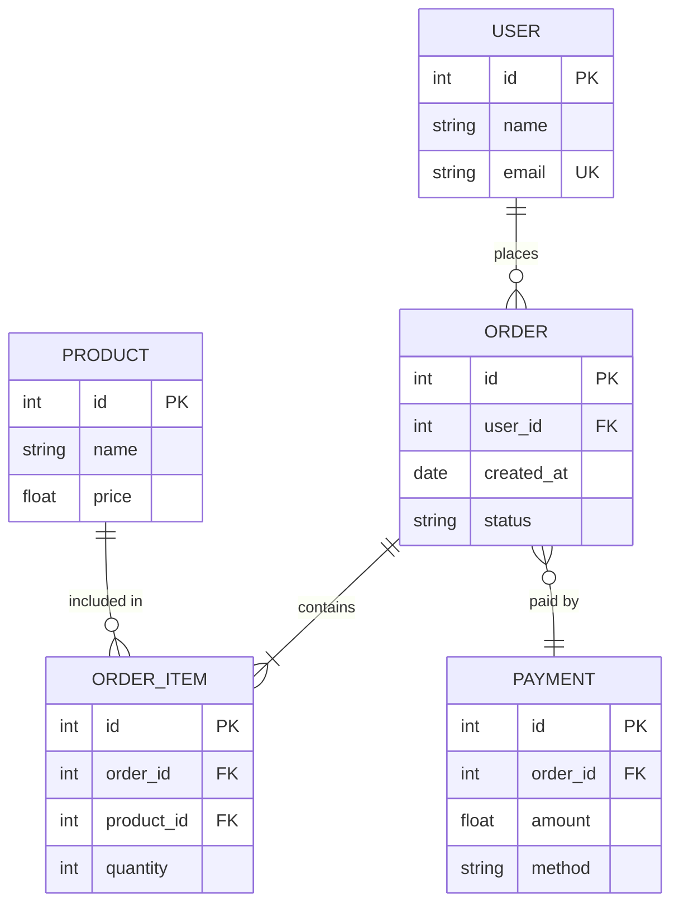

# Common Diagram Pattern Library

For the following high-frequency scenarios, reference the corresponding pattern structure directly — no need to design nodes and edges from scratch.

---

## RAG Pipeline

**Use case**: RAG systems, knowledge base Q&A

---

## Agentic RAG

**Use case**: AI Agents with tool calling

---

## Authentication Flow

**Use case**: OAuth/JWT authentication flows

---

## Microservice Architecture

**Use case**: System architecture overview

---

## CI/CD Pipeline

**Use case**: DevOps workflows

---

## Data Flow (ETL)

**Use case**: Data processing pipelines

---

## Decision Matrix (Quadrant Chart)

**Use case**: Technology selection, priority ranking

---

## Project Schedule (Gantt Chart)

**Use case**: Project management, milestone planning

---

## ER Diagram (Database Design)

**Use case**: Database schema design

---

## Usage Guide

1. Find the most matching scenario pattern
2. Copy the structure, replace node names and labels
3. Add or remove nodes as needed
4. Choose an appropriate diagram direction (TD/LR)
