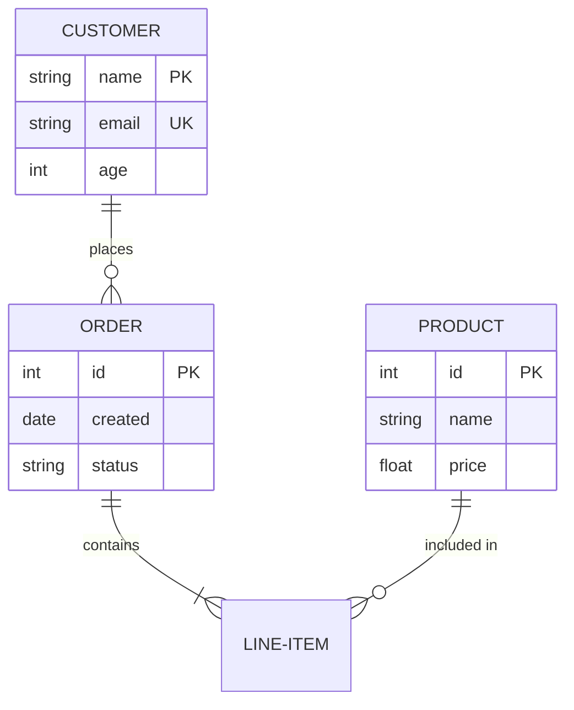
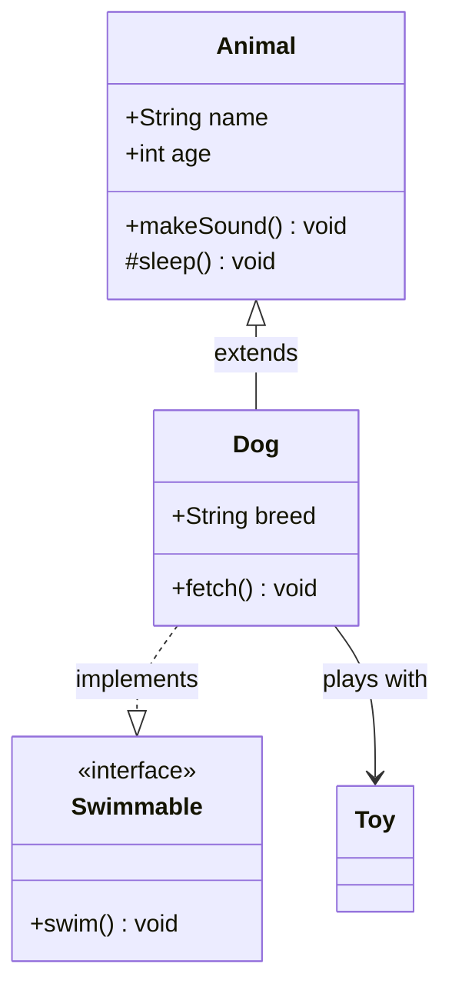

# ER Diagram & Class Diagram Syntax Reference

## ER Diagram (erDiagram)



### Relationship Symbols

| Left | Relationship | Right | Meaning |
|------|-------------|-------|---------|
| `\|` | -- | `\|` | One to one |
| `\|o` | -- | `o\|` | Zero or one |
| `\|{` | -- | `}\|` | One to many |
| `\|o` | -- | `o{` | Zero to many |
| `}\|` | -- | `\|{` | Many to many |

### Attribute Modifiers

- `PK` — Primary Key
- `FK` — Foreign Key
- `UK` — Unique Key

---

## Class Diagram (classDiagram)



### Visibility

| Symbol | Meaning |
|--------|---------|
| `+` | public |
| `-` | private |
| `#` | protected |
| `~` | package |

### Relationship Arrows

| Syntax | Meaning |
|--------|---------|
| `<\|--` | Inheritance (extends) |
| `\|-->\|` | Implementation (implements) |
| `-->` | Association |
| `..>` | Dependency |
| `o--` | Aggregation |
| `*--` | Composition |

### Relationship Labels

```
A --> B : label text
A "1" --> "0..*" B : has
```

### Enums & Abstract Classes

```
class Color {
    <<enumeration>>
    RED
    GREEN
    BLUE
}

class Shape {
    <<abstract>>
    +draw() void
}
```

## Best Practices

1. ER diagrams: draw entities and relationship lines first, then add attributes
2. Class diagrams: place parent classes above, child classes below
3. Don't exceed 8 entities/classes per diagram — split if needed
4. Use verbs for relationship labels: places, contains, belongs_to
