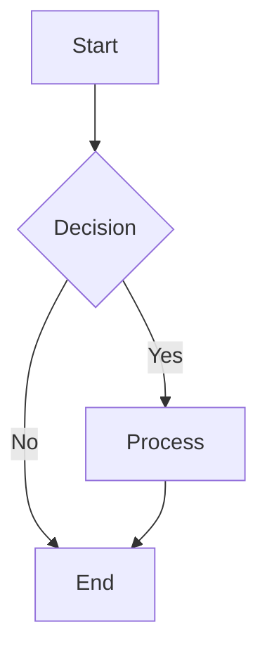
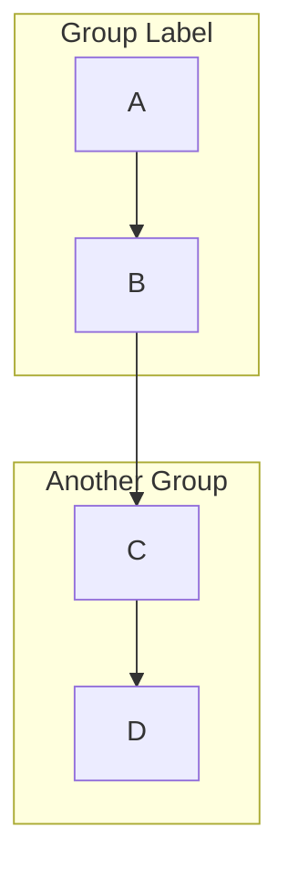

# Flowchart Syntax Reference (flowchart / graph)

## Basic Structure



## Directions

| Code | Direction |
|------|-----------|
| `TD` / `TB` | Top → Bottom |
| `BT` | Bottom → Top |
| `LR` | Left → Right |
| `RL` | Right → Left |

## Node Shapes

| Syntax | Shape | Example |
|--------|-------|---------|
| `[text]` | Rectangle | `A[Process]` |
| `(text)` | Rounded rectangle | `A(Start)` |
| `{text}` | Diamond (decision) | `A{Choice?}` |
| `((text))` | Circle | `A((DB))` |
| `[[text]]` | Subroutine | `A[[sub]]` |
| `[(text)]` | Cylinder (database) | `A[(data)]` |
| `>text]` | Flag | `A>flag]` |
| `{{text}}` | Hexagon | `A{{hex}}` |
| `[/text/]` | Parallelogram | `A[/input/]` |
| `[\text\]` | Inverted parallelogram | `A[\output\]` |

## Connection Lines

| Syntax | Style |
|--------|-------|
| `-->` | Solid line with arrow |
| `---` | Solid line without arrow |
| `-.-` | Dashed line without arrow |
| `-.->` | Dashed line with arrow |
| `==>` | Thick line with arrow |
| `--text-->` | Labeled arrow |

## Subgraphs



## Styling

```
style A fill:#e1f5fe,stroke:#0288d1,stroke-width:2px
classDef highlight fill:#ff9,stroke:#333,stroke-width:2px
class A,B,C highlight
```

## Best Practices

1. Keep node IDs short: use `A["Long description text"]` instead of `LongName["description"]`
2. Break complex diagrams into subgraphs; avoid large flat layouts
3. Wrap non-English text in quotes: `A["中文节点"]`
4. Escape special characters: wrap `()` `[]` `{}` `>` in quotes
5. Consider splitting into multiple diagrams when exceeding 20 nodes
