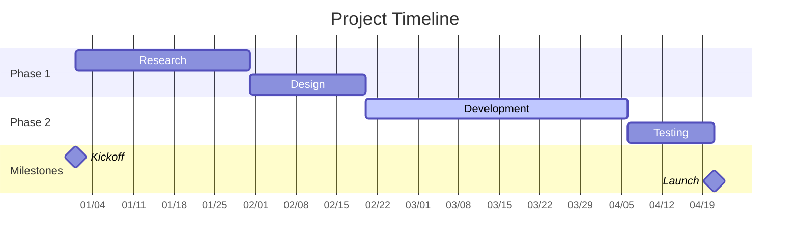
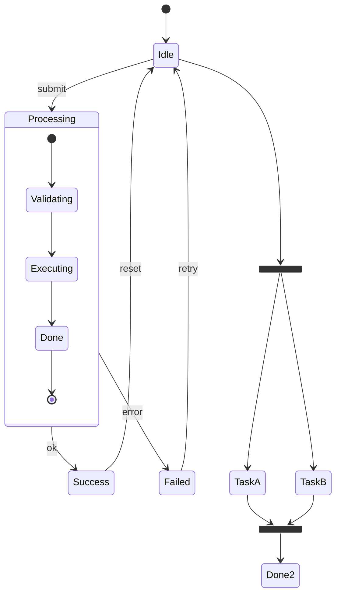

# Gantt Chart & State Diagram Syntax Reference

## Gantt Chart (gantt)



### Task Status

| Syntax | Status |
|--------|--------|
| (default) | Normal |
| `active` | In progress |
| `done` | Completed |
| `crit` | Critical path |

### Date Format

| Placeholder | Meaning |
|-------------|---------|
| `YYYY` | Four-digit year |
| `MM` | Month |
| `DD` | Day |
| `MMM` | Abbreviated month (Jan) |

### Task Definition Styles

```
Task Name  :ID, start date, duration in days
Task Name  :ID, after predecessor ID, duration in days
Task Name  :ID, start date, end date
```

---

## State Diagram (stateDiagram-v2)



### State Types

| Syntax | Meaning |
|--------|---------|
| `[*]` | Start / end state |
| `state Name { }` | Composite state (nested) |
| `<<fork>>` | Fork (parallel) |
| `<<join>>` | Join (parallel) |
| `<<choice>>` | Choice point |

### Transition Syntax

```
StateA --> StateB : event [guard] / action
```

- event: triggering event
- [guard]: guard condition (optional)
- /action: action to execute (optional)

### Notes

```
note right of Idle: Waiting for user action
note left of Processing: Processing
```

## Best Practices

1. Gantt charts: no more than 6 sections, no more than 20 tasks total
2. State diagrams: place start state top-left, end state bottom-right
3. State diagrams: keep nesting to 3 levels or fewer
4. Gantt charts: use `after` to link dependencies; avoid hardcoding dates
