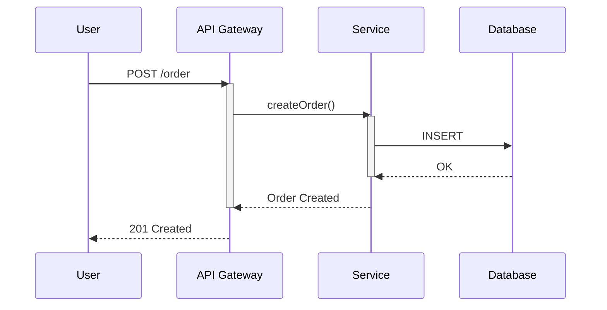

# Sequence Diagram Syntax Reference (sequenceDiagram)

## Basic Structure



## Arrow Types

| Syntax | Meaning |
|--------|---------|
| `->` | Solid line, no arrow |
| `-->` | Dashed line, no arrow |
| `->>` | Solid line with arrow |
| `-->>` | Dashed line with arrow |
| `-x` | Solid line with cross |
| `--x` | Dashed line with cross |
| `-)` | Solid line with open arrow (async) |

## Activation Bars

```
activate A    % start
deactivate A  % end
```

Shorthand: `+A` auto-activates, `-A` auto-deactivates:
```
A->>+B: request
B-->>-A: response
```

## Grouping Frames

| Keyword | Purpose |
|---------|---------|
| `loop` | Loop |
| `alt` / `else` | Conditional branches |
| `opt` | Optional |
| `par` / `and` | Parallel |
| `critical` / `option` | Critical region |
| `break` | Break |

```
alt Success
    A-->>U: 201
else Error
    A-->>U: 500
end
```

## Notes

```
Note over A,B: Cross-participant note
Note right of A: Note on the right
Note left of B: Note on the left
```

## Delays

```
Note over A,B: Waiting for processing...
```

## Best Practices

1. Order participants by appearance (or explicitly declare with `participant`)
2. Use activation bars for clearer flow — highly recommended
3. Use grouping frames (alt/loop) to make logic more readable
4. Keep message labels short, ideally ≤5 words
5. Consider splitting when exceeding 15 messages
