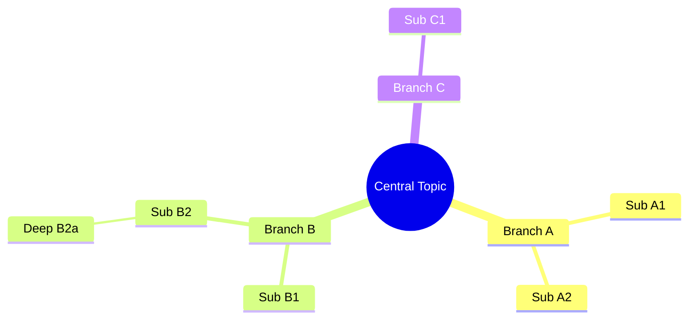
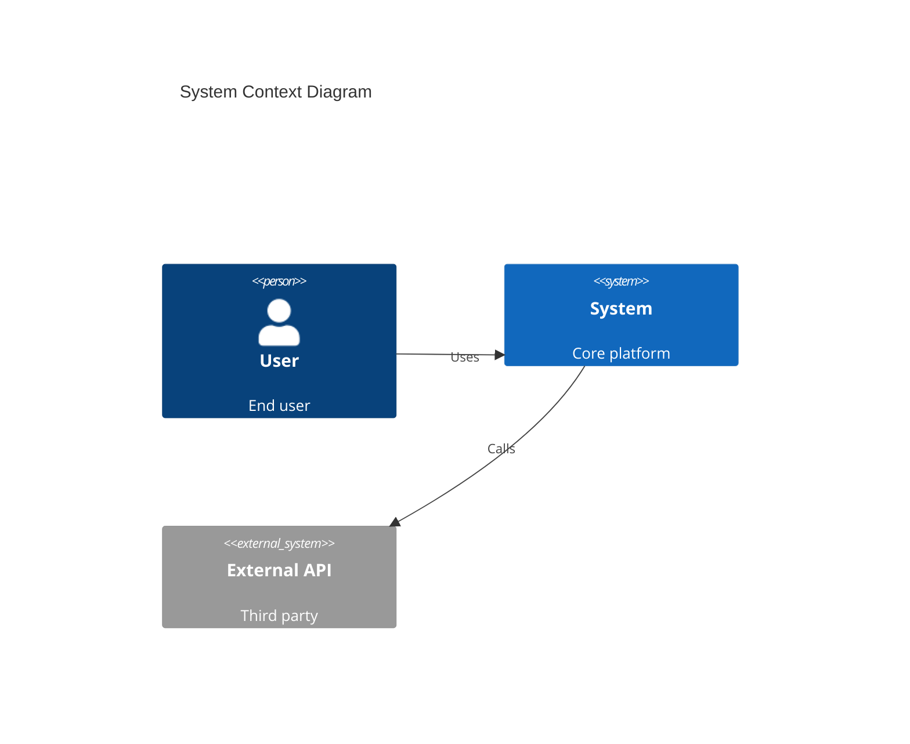
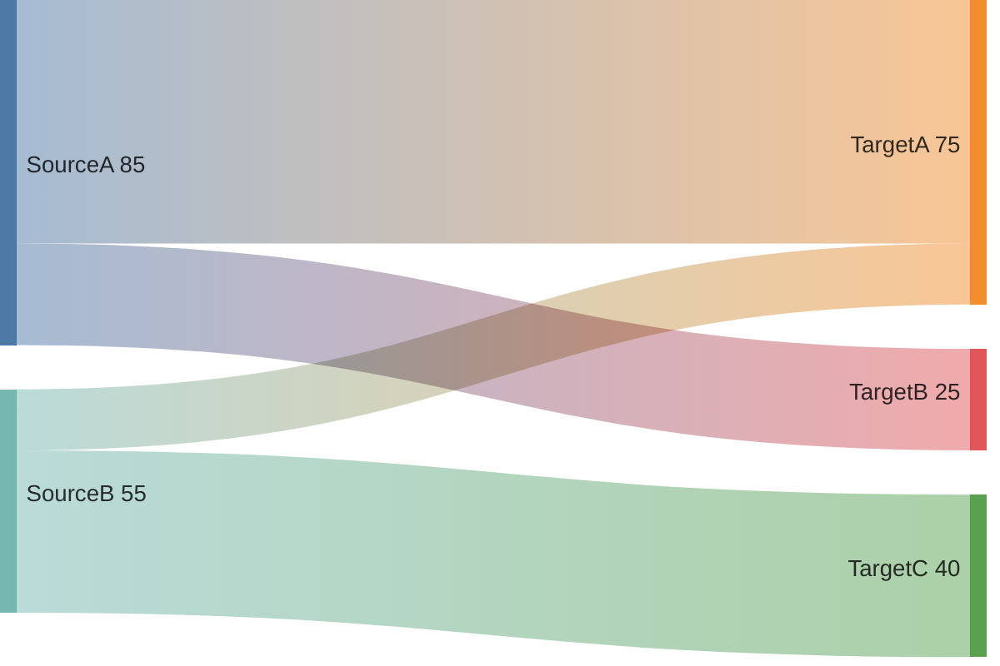
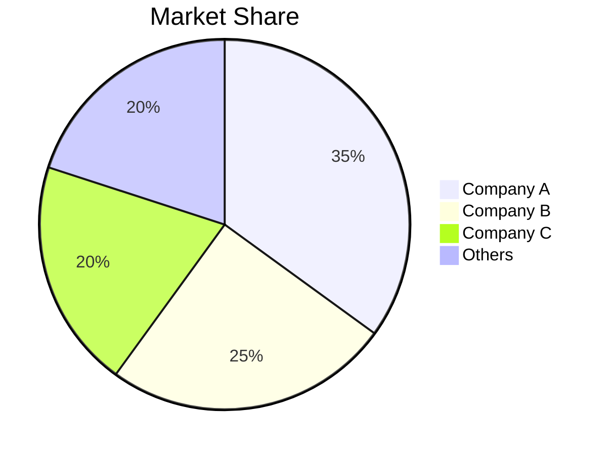
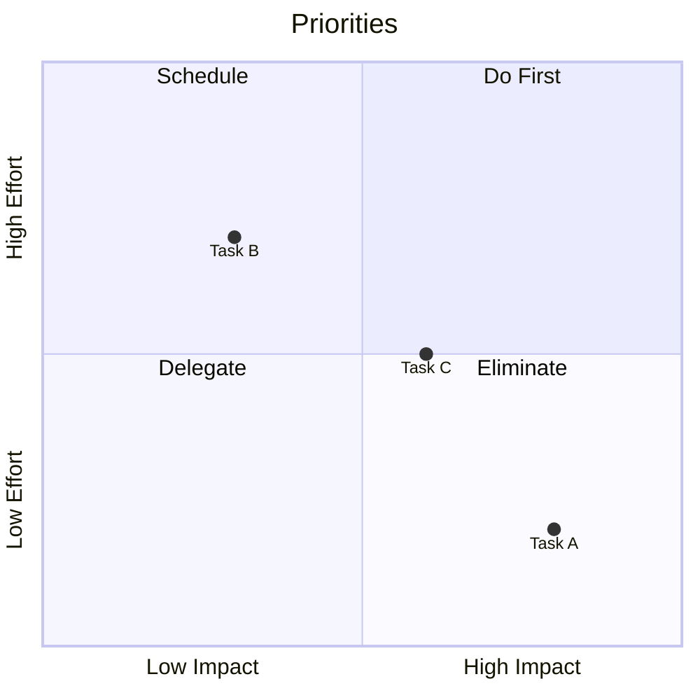
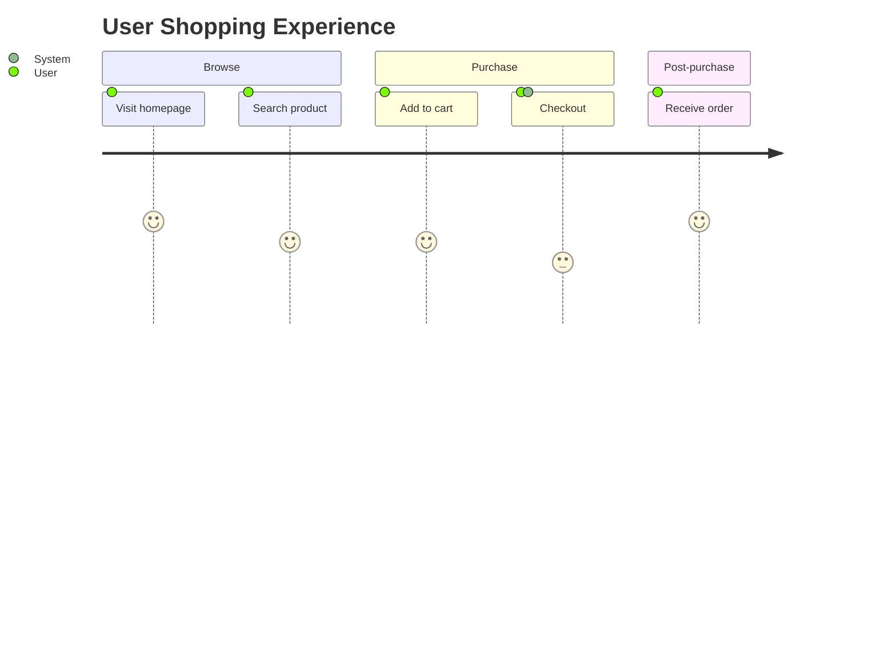
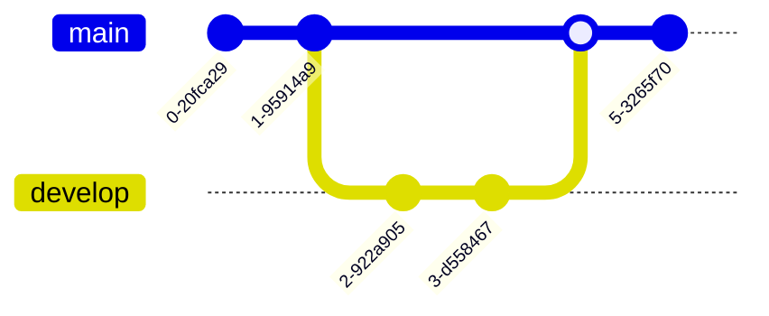
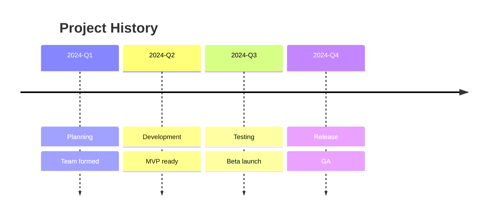

# Specialized Chart Syntax Reference

## Mind Map (mindmap)



- Auto-layout; no need to specify positions
- Nested indentation represents hierarchy
- More than 4 levels of nesting becomes cramped

---

## C4 Architecture Diagram



### C4 Levels

| Keyword | Level | Description |
|---------|-------|-------------|
| `C4Context` | L1 System Context | Outermost view |
| `C4Container` | L2 Container | Decompose system internals |
| `C4Deployment` | L3 Deployment | Infrastructure view |

### Element Types

| Type | Syntax |
|------|--------|
| Person | `Person(id, "Name", "Desc")` |
| External Person | `Person_Ext(id, "Name", "Desc")` |
| System | `System(id, "Name", "Desc")` |
| External System | `System_Ext(id, "Name", "Desc")` |
| Container | `Container(id, "Name", "Tech", "Desc")` |
| Component | `Component(id, "Name", "Tech", "Desc")` |
| Database | `ContainerDb(id, "Name", "Tech", "Desc")` |
| Queue | `ContainerQueue(id, "Name", "Tech", "Desc")` |

---

## Sankey (Flow / Fund Direction)



- Format: `source,target,value`
- Width ratios are calculated automatically
- Suitable for: fund flows, energy flows, user conversion

---

## Pie Chart (pie)



---

## Quadrant Chart (quadrantChart)



Coordinate values range from [0, 1].

---

## User Journey (journey)



Score 1–5 (1 = bad, 5 = good).

---

## Git Graph (gitGraph)



---

## Timeline (timeline)



---

## Fishbone Diagram (fishbone / Ishikawa)

```mermaid
fishbone
    category "Cause A" ["Reason 1", "Reason 2"]
    category "Cause B" ["Reason 3", "Reason 4"]
    "Problem Statement"
```

---

## Radar Chart (radar)


---

## Venn Diagram (venn)

```mermaid
venn
    title Team Skills
    A["Frontend"]
    B["Backend"]
    C["DevOps"]
    A & B["Full Stack"]
    B & C["Infrastructure"]
    A & C["CI/CD"]
    A & B & C["All Rounder"]
```

## Best Practices

1. Mind maps: center topic ≤3 words, branches ≤6
2. C4: one diagram per level, don't mix levels
3. Sankey: clear naming for sources and targets to avoid ambiguity
4. Pie charts: no more than 7 categories
5. Quadrant charts: 3–5 items per quadrant
